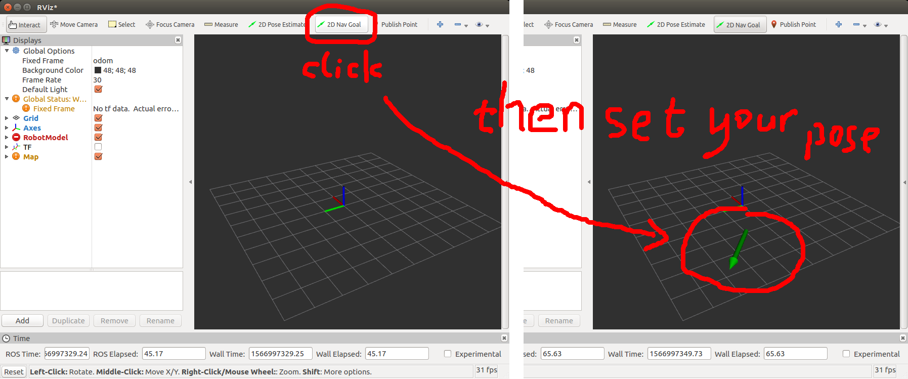

# waypoint_generator

[](https://travis-ci.org/epan-utbm/waypoint_generator) [](https://www.codacy.com/gh/epan-utbm/waypoint_generator?utm_source=github.com&amp;utm_medium=referral&amp;utm_content=epan-utbm/waypoint_generator&amp;utm_campaign=Badge_Grade) [](https://opensource.org/licenses/BSD-3-Clause)

Modified from https://github.com/jihoonl/waypoint/tree/master/waypoint_generator with "orientation" added.

## Usage

```console
$ rosrun waypoint_generator waypoint_generator.py
```

or

```console
$ cd waypoint_generator/scripts
$ chmod +x waypoint_generator.py
$ ./waypoint_generator.py
```



*Tested with Ubuntu 16.04 LTS + ROS Kinetic*
